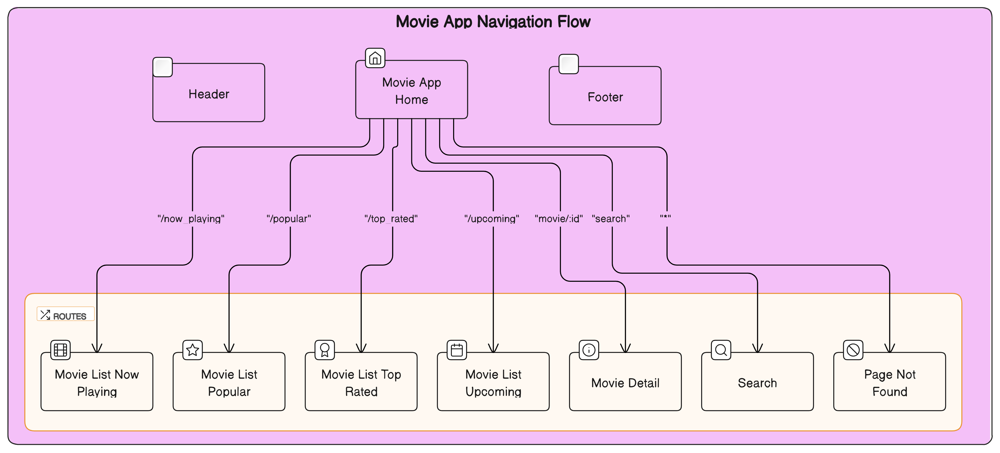
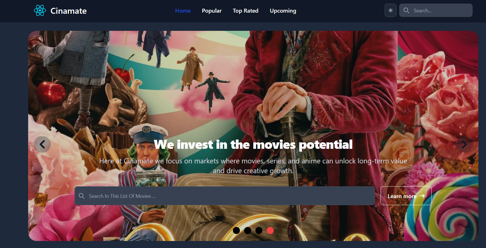
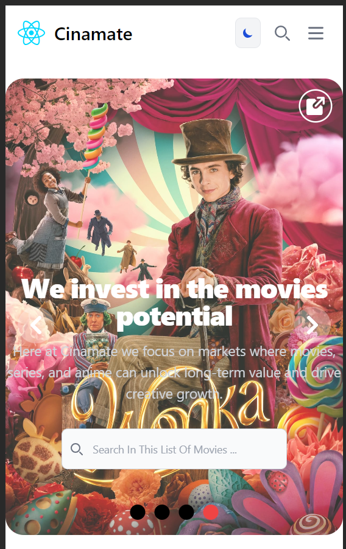
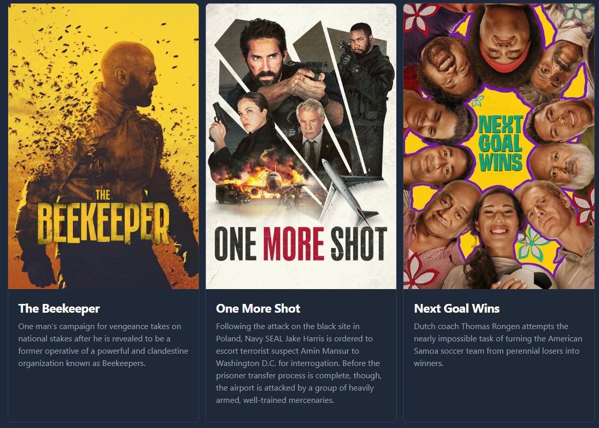
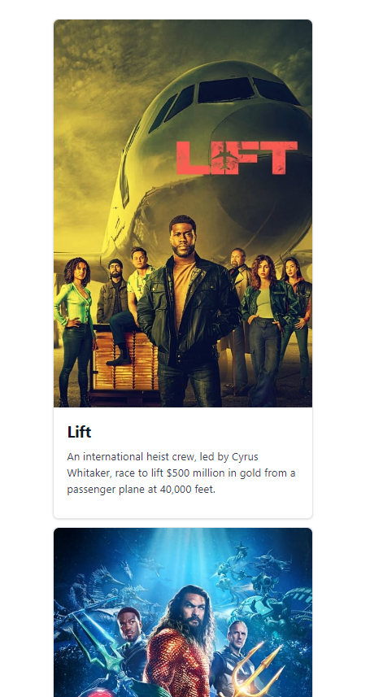
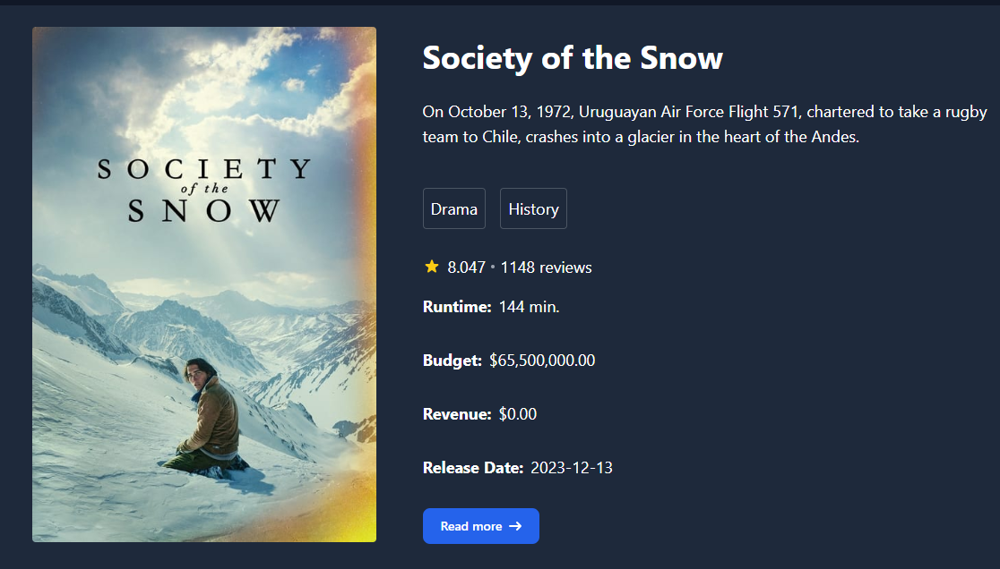
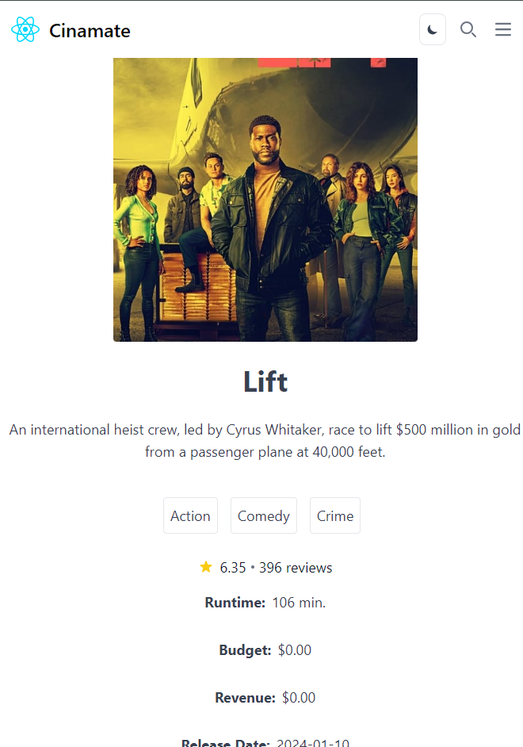

# Cinamate - TMDB Movie Explorer

## Table of Contents

- [Overview](#overview)
- [Navigation Flow](#navigation-flow)
- [Features](#features)
- [Built With](#built-with)
- [Getting Started](#getting-started)
- [Environment Variables](#environment-variables)
- [Recent Improvements](#recent-improvements)
- [Screenshots](#screenshots)

## Overview

### Project Insight: 📚

Cinamate is a modern, responsive web application that allows users to explore movies from The Movie Database (TMDB). The application provides an intuitive interface for browsing popular movies, top-rated films, upcoming releases, and searching for specific titles. Built with React, TypeScript, and Tailwind CSS, Cinamate offers a seamless and engaging user experience across all devices.

## Navigation Flow

Here is the navigation flow for Cinamate using React Router:


**Live Demo:** [Explore Cinamate](https://react-tmdb-api.netlify.app/)

## Features

**Key Features:**

- **Responsive Design**: Fully responsive UI that works seamlessly on desktop, tablet, and mobile devices
- **Movie Exploration**: Browse popular, top-rated, and upcoming movies
- **Search Functionality**: Search for movies by title or keywords
- **Movie Details**: View comprehensive details about each movie, including synopsis, ratings, cast, and more
- **Dark Mode**: Toggle between light and dark themes for comfortable viewing
- **Data Validation**: Robust data validation using Zod to ensure data integrity
- **Type Safety**: Full TypeScript implementation for enhanced code quality and developer experience
- **Environment Management**: Secure and type-safe environment variable handling
- **Smooth Animations**: Engaging animations and transitions using Framer Motion
- **Accessibility**: Designed with accessibility in mind for an inclusive user experience

## Built With

**Technologies Used:**

- [React](https://react.dev/) - UI library
- [TypeScript](https://www.typescriptlang.org/) - Type safety
- [Tailwind CSS](https://tailwindcss.com/) - Styling
- [React Router](https://reactrouter.com/) - Navigation
- [Zod](https://zod.dev/) - Data validation
- [Framer Motion](https://www.framer.com/motion/) - Animations
- [Headless UI](https://headlessui.com/) - Accessible UI components
- [Heroicons](https://heroicons.com/) - Beautiful SVG icons
- [T3 Env](https://github.com/t3-oss/t3-env) - Environment variable management
- [React Toastify](https://fkhadra.github.io/react-toastify/) - Toast notifications

## Getting Started

### Prerequisites

- Node.js (v14 or higher)
- npm or yarn
- Docker and Docker Compose (optional, for containerized development)

### Installation

#### Option 1: Local Development

1. Clone the repository:
   ```bash
   git clone https://github.com/yourusername/cinamate.git
   cd cinamate
   ```

2. Install dependencies:
   ```bash
   npm install
   # or
   yarn install
   ```

3. Create a `.env` file in the root directory based on `.env.example`:
   ```bash
   cp .env.example .env
   ```

4. Add your TMDB API key to the `.env` file:
   ```
   VITE_TMDB_API_KEY=your_tmdb_api_key_here
   ```

5. Start the development server:
   ```bash
   npm run dev
   # or
   yarn dev
   ```

#### Option 2: Docker Development

1. Clone the repository:
   ```bash
   git clone https://github.com/yourusername/cinamate.git
   cd cinamate
   ```

2. Create a `.env` file in the root directory based on `.env.example`:
   ```bash
   cp .env.example .env
   ```

3. Add your TMDB API key to the `.env` file:
   ```
   VITE_TMDB_API_KEY=your_tmdb_api_key_here
   ```

4. Start the development container:
   ```bash
   npm run docker:dev
   # or
   docker-compose up app-dev
   ```

5. The application will be available at http://localhost:3000

### Production Deployment with Docker

1. Build and run the production container:
   ```bash
   npm run docker:prod
   # or
   docker-compose up app-prod
   ```

2. The application will be available at http://localhost:80

### Docker Commands

| Command | Description |
|---------|-------------|
| `npm run docker:build` | Build the Docker image |
| `npm run docker:run` | Run the Docker container |
| `npm run docker:dev` | Start development environment with Docker |
| `npm run docker:prod` | Start production environment with Docker |
| `npm run docker:stop` | Stop all Docker containers |

## Environment Variables

Cinamate uses a type-safe approach to environment variables with `@t3-oss/env-core`. The following environment variables are required:

| Variable | Description | Default |
|----------|-------------|---------|
| `VITE_BASE_URL` | TMDB API base URL | https://api.themoviedb.org/3 |
| `VITE_TMDB_API_KEY` | Your TMDB API key | (required) |
| `VITE_IMAGE_BASE_URL` | TMDB image base URL | https://image.tmdb.org/t/p/w500 |

## Recent Improvements

### Data Validation with Zod

We've implemented Zod for robust data validation throughout the application. This ensures that data from the API conforms to our expected schema, providing better error handling and type safety.

### Environment Variable Management

We've adopted `@t3-oss/env-core` for type-safe environment variable management, following best practices from [this article](https://www.raulmelo.me/en/blog/best-practices-for-handling-per-environment-config-js-ts-applications).

### UI/UX Enhancements

- Added smooth animations and transitions with Framer Motion
- Improved responsive design for better mobile experience
- Enhanced accessibility with Headless UI components
- Implemented toast notifications for better user feedback
- Redesigned movie cards and detail pages for better visual hierarchy
- Improved dark mode implementation

### Docker and CI/CD Integration

- **Containerization**: Added Docker support for consistent development and production environments
- **Multi-stage Builds**: Optimized Docker builds with multi-stage process for smaller production images
- **Development Workflow**: Configured docker-compose for easy local development
- **CI Pipeline**: Implemented GitHub Actions workflows for automated testing and building
- **CD Pipeline**: Set up automated Docker image building and deployment
- **Preview Deployments**: Added preview deployments for pull requests

## Screenshots

| Home Page - Carousel                               | Home Page (Mobile) - Carousel                               |
| -------------------------------------------------- | ----------------------------------------------------------- |
|  |  |

| Home Page - Movies List                           | Home Page (Mobile) - Movies List                           |
| ------------------------------------------------- | ---------------------------------------------------------- |
|  |  |

| Home Page - Movie Details                             | Home Page (Mobile) - Movies Details                            |
| ----------------------------------------------------- | -------------------------------------------------------------- |
|  |  |
