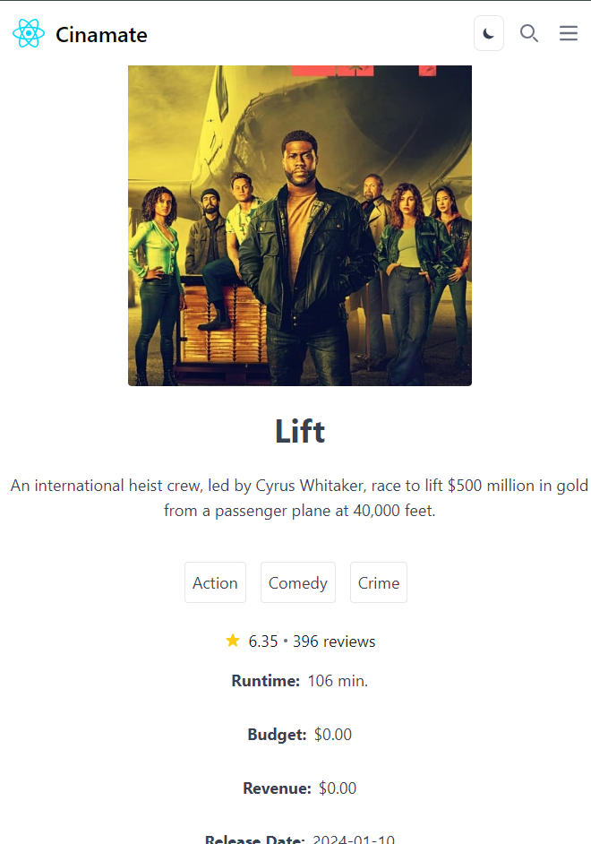

# React + TypeScript + Vite + Tailwind

## Live web site

- [Navigation Flow](#navigation-flow)
- [Overview](#overview)
- [Built With](#built-with)
- [Features](#features)
- [Status](#status)

## Overview

### Project Insight: 📚

A side project to create a TMDb clone using React. This endeavor involved leveraging React's capabilities, utilizing the React Router for navigation, and adhering to TypeScript best practices. The project primarily focuses on making API calls through the `fetch` method. The result is a responsive application that showcases movies, their details, and a clean navigation experience.

## Navigation Flow

Here is the navigation flow for the TMDb Movie Clone using React Router:

**Live Demo:** [Explore the React TMDb Clone](https://react-tmdb-api.netlify.app/)

**Screenshots:**

| Home Page - Carousel                               | Home Page (Mobile) - Carousel                               |
| -------------------------------------------------- | ----------------------------------------------------------- |
|  |  |

| Home Page - Movies List                           | Home Page (Mobile) - Movies List                           |
| ------------------------------------------------- | ---------------------------------------------------------- |
|  |  |

| Home Page - Movie Details                             | Home Page (Mobile) - Movies Details                            |
| ----------------------------------------------------- | -------------------------------------------------------------- |
|  |  |

## Built With

**Technologies Used:**

- [React](https://react.dev/)

- [React Router](https://reactrouter.com/en/main)
- [TypeScript](https://www.typescriptlang.org/)
- [Tailwind CSS](https://tailwindcss.com/)

## Features

**Key Features:**

- Seamless navigation with React Router for an enhanced user experience.
- Implementation of custom fetch and local storage hooks, utilizing generic types for versatility.
- Utilization of barrel exports to effectively organize React components.
- Adherence to TypeScript best practices for robust and maintainable code.

## Status

**Upcoming Enhancements:**

- Integration of ZOD for data validations.
- Exploration other solutions for managing environment variables, such as mentioned in this post [Best Practices for Handling Per-Environment Configuration in Your JS/TS Applications](https://www.raulmelo.me/en/blog/best-practices-for-handling-per-environment-config-js-ts-applications).
- etc ...
